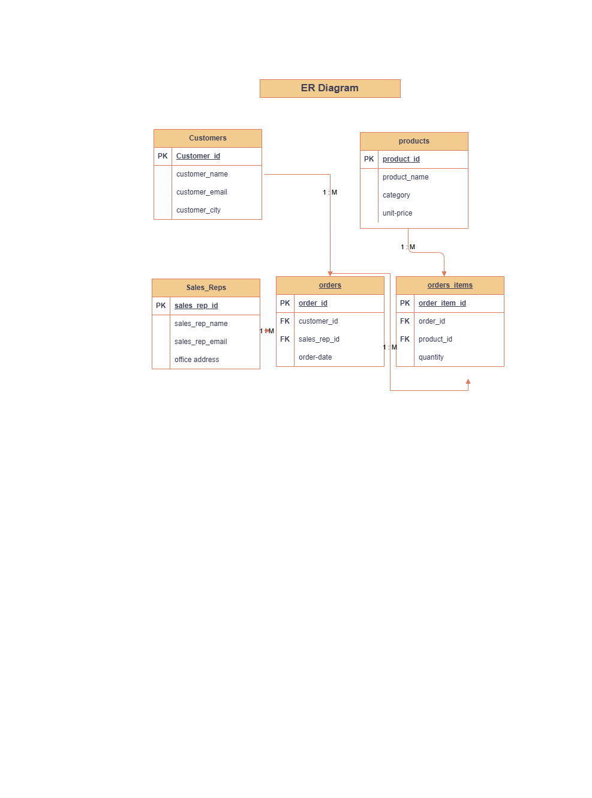

## Anomaly Analysis

### 🔴 1. Insert Anomaly

**Issue:** You cannot insert a new product unless there is an order.

**Example (from dataset):**  
- Columns: `product_id`, `product_name`, `category`, `unit_price`  
- In the CSV, product data appears only when an order exists (e.g., `product_id = P101`, `P102` are present only with an `order_id`).  
- If we want to add a new product `P999` (New Laptop) without creating an order, it is not possible.

**Why it’s a problem:**  
- Product catalog cannot be maintained independently of orders.

---

### 🔴 2. Update Anomaly

**Issue:** Updating data requires multiple row updates.

**Example (from dataset):**  
- Rows where `sales_rep_id = SR002` (e.g., `order_id = ORD001`, `ORD003`, `ORD005`)  
- Columns: `sales_rep_email`, `office_address`  

If `SR002` changes office address:  
- All corresponding rows must be updated  
- Missing even one row leads to inconsistent data  

**Why it’s a problem:**  
- The same sales representative may have different details in different rows.

---

### 🔴 3. Delete Anomaly

**Issue:** Deleting a row removes important related data.

**Example (from dataset):**  
- If the row containing `order_id = ORD004` and `product_id = P105` is deleted  
- Then the following information is lost:
  - `product_name`  
  - `category`  
  - `unit_price`  

**Why it’s a problem:**  
- Product information is lost even though the product still exists.

## Normalization Justification

Keeping all data in a single table may seem simpler initially, but it creates significant data integrity and maintenance issues. In the given dataset, customer, product, order, and sales representative information are repeated across multiple rows. For example, the same customer_id appears multiple times with identical customer_name and customer_email. If a customer's email changes, it must be updated in every row where the customer appears. This leads to update anomalies and increases the risk of inconsistent data.

Similarly, product details such as product_name and unit_price are repeated for every order containing that product. If the price changes, multiple rows must be updated. If even one row is missed, incorrect reporting can occur.

Insert anomalies also arise. For instance, a new product cannot be added unless there is an associated order, because order_id is required. This limits flexibility in managing independent entities.

Delete anomalies are equally problematic. Deleting a single order may remove all information about a product or customer if it exists only in that row. This leads to unintended data loss.

By normalizing the schema into separate tables (customers, products, orders, sales representatives, and order items), we eliminate redundancy, ensure consistency, and improve scalability. Each entity is stored once and referenced using foreign keys. This design aligns with Third Normal Form (3NF), where all non-key attributes depend only on the primary key, ensuring efficient and reliable database management.

## ER Diagram

The following ER diagram represents the normalized database schema:

